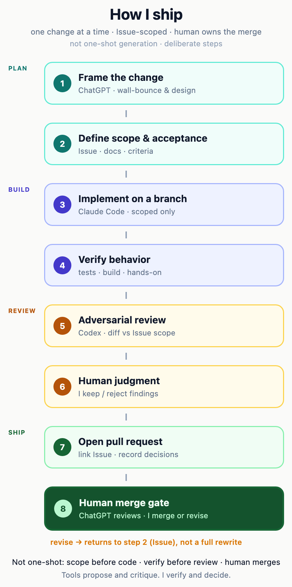
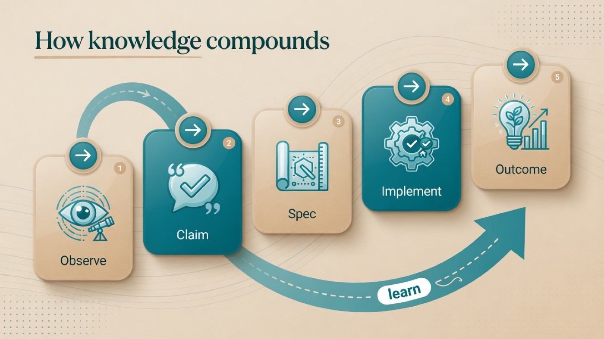
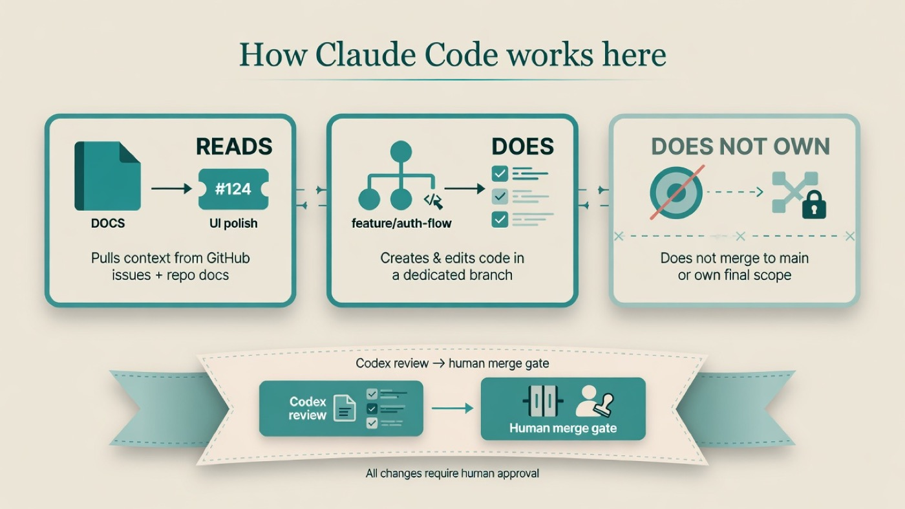

<!--
  Mobile-first profile surface:
  - one wide banner so Start here stays near first scroll
  - no multi-column galleries, no autoplay video
  Banner: assets/pin-banner.jpg (= variations/05-flat-split)
  Alts: assets/alt-01-geometric.jpg, assets/alt-07-washi-ink.jpg
  Claims (fact-checked with owner 2026-07-18 / 2026-07-19):
  - Onedrop: built attendance/ops systems — NOT the public school website (onedrop2025.com)
  - Kodomo Shinro pair: commissioned by Onedrop — site + diagnostic (2 products)
  - Dev loop (Codex-reviewed 2026-07-19, VERDICT request-changes applied):
    Frame → Define Issue/docs/acceptance → Implement (Claude Code) → Verify → Codex review → Human judgment → PR → Human merge gate (ChatGPT assists; I merge/revise)
  - Evidence: onedrop/WORKFLOW.md; 260719_how_i_ship_codex_review.md
  - Knowledge + Claude Code axis (Codex-reviewed 2026-07-19, request-changes applied): see 260719_profile_axis_codex_review.md
-->

  

<h1 align="center">Tatsunori Tojo</h1>

  <strong>From education into software.</strong> 
  I build tools for learning and everyday work — mostly on the web.

### Start here

- [Portfolio](https://tatsunoritojo.com) — selected work and writing
- [MacKairu](https://github.com/tatsunoritojo/MacKairu) — a resident mascot AI for macOS
- [Onedrop attendance & ops](https://tatsunoritojo.com/works/education-ops) — school operations systems (attendance and related tooling; not the public school website)
- [こどもの進路案内所](https://kodomo-shinro.jp) · [通信制高校診断](https://shindan.kodomo-shinro.jp/) — two sites built for Onedrop (parent guide + diagnostic)
- [あいプリントLab](https://hirodai-3d-aiprint.com/) — Hiroshima University 3D-printer circle site (redesign; accessibility-first)
- [シフリー](https://tatsunoritojo.com/works/shifree) — shift-scheduling SaaS for small teams (希望→確定→Google Calendar; code private)

### How I ship

Not a one-shot magic button. One change at a time.

  

Issue-scoped. Verify before review. I merge (ChatGPT can argue). 
Tools propose and critique. I verify and decide. Mostly.

### How knowledge compounds

Useful observations become evidence-backed claims before they guide implementation.

  

Useful observations become evidence-backed claims; outcomes decide what survives. Decisions move into repository docs when they affect a product. Chat is draft, not source of truth.

### How Claude Code works here

Claude Code is the implementer in the repository — not the product owner.

  

Claude Code implements scoped changes; I own product decisions, review judgment, and merge.

  Public experiments live in the pin below · more at <a href="https://github.com/tatsunoritojo/pin-only">pin-only</a>

