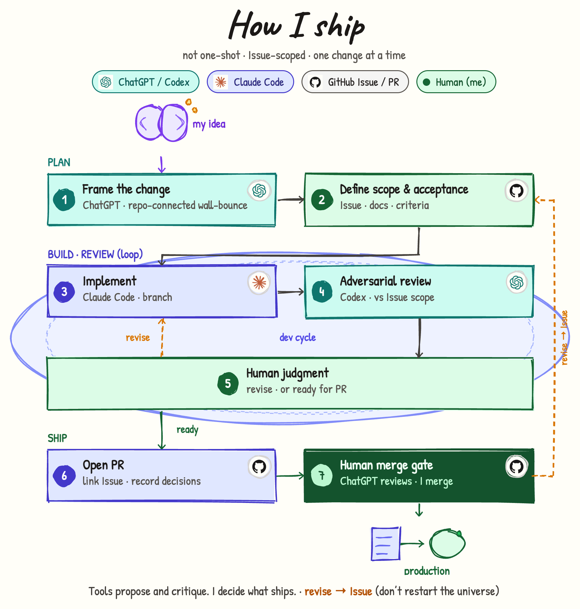

# How I ship

[日本語](./ja/how-i-ship.md) · [How knowledge compounds](./how-knowledge.md) · [How Claude Code works here](./how-claude.md)

---

## What this page explains

This page explains **how I move one software change from information gathering to a human merge decision** (and then toward production).

It is not a catalog of AI brands. It answers:

| Question | Answer in this process |
|----------|------------------------|
| Where do I start? | **Information gathering and wall-bounce** (not coding first) |
| What is the unit of work? | **One GitHub Issue** with acceptance criteria |
| Who writes most of the code? | **Claude Code** on a branch |
| Who stress-tests the diff? | **Codex** against the Issue |
| Who decides? | **Me** (findings and merge) |

**Related pages**

- Longer arc before a change is an Issue: [How knowledge compounds](./how-knowledge.md)  
- Claude’s boundary only: [How Claude Code works here](./how-claude.md)  

---

## Start with information gathering

Before “what should we build,” I collect **what is already true** about the repository and the situation. Skipping this makes both wall-bounce and implementation ungrounded.

### What I gather

| Kind | Examples |
|------|----------|
| Facts in the repo | Layout, existing code, tests, config, related docs / ADRs |
| Trigger | Bug report, request, note, incident write-up |
| Constraints | Deadline, no-touch areas, security / PII |
| Acceptance material | Who needs what to work, on which surface |

### Wall-bounce with ChatGPT connected to the real repository

The ChatGPT session used for framing is **connected to the actual repository**.

That means:

- Discussion is grounded in **real code and structure**, not generic advice  
- We can talk about “where this likely lives” and “what already exists” with higher confidence  
- The wall-bounce is higher quality  

What I want out of this stage:

- A one-line problem statement  
- Option set and trade-offs  
- Decisions a human must make before coding  
- Draft acceptance ideas for the Issue  

This is still **not** a fixed contract. It produces **options and questions**.

---

## Who does what

| Responsibility | Who / tools | What they do |
|----------------|-------------|--------------|
| Gather & wall-bounce | Me + ChatGPT (repo-connected) | Collect facts; explore approaches |
| Lock scope | Me + GitHub Issue | Write acceptance and “done” |
| Implement | Claude Code | Scoped changes on a branch |
| Adversarial review | Codex | Challenge the diff vs the Issue |
| Judge findings | Me | Keep, drop, or question scope |
| Open PR | Claude Code | PR linked to the Issue, with history |
| Merge | Me | Merge to main or return to the Issue |

Diagram colors roughly mean: teal = ChatGPT/Codex, indigo = Claude Code, green = human, GitHub marks = Issue/PR as control surface.

---

## Steps (1–7, same as the diagram)

### Plan — decide what will change

#### 1. Frame the change (ChatGPT)

**Goal:** Organize the problem and options using repository fact.

**I do:**

1. Write the trigger briefly  
2. Wall-bounce with **repo-connected ChatGPT** about current code, similar places, constraints  
3. List candidate approaches and open decisions  
4. Do **not** freeze the Issue yet if information is still missing  

**Done when:**

- The problem fits in one sentence  
- At least one approach exists  
- Human decisions are listed  

#### 2. Define scope & acceptance (me · GitHub Issue)

**Goal:** Make the Issue the **only binding standard** for implement and review.

**Minimum Issue contents:**

| Field | Content |
|-------|---------|
| What changes | Screens, APIs, data, etc. |
| What does not | Explicit out-of-scope |
| Acceptance | Concrete “done” checks |
| Basis | Links to docs / ADR / research notes |
| Risk | Fragile areas, PII, auth |

**Done when** another person would mark the same checks “done.”

From here, the **Issue is the contract**. Wall-bounce chat is supporting material only.

---

### Build · review — make, challenge, fix (loop)

#### 3. Implement (Claude Code)

**Goal:** Produce a branch that aims to meet the Issue.

**Practice:**

- Dedicated branch (no direct push to main)  
- No drive-by refactors outside scope  
- Run automated tests/build that apply  

Hands-on checks are mine when the change needs a human eye. Claude is not treated as sole verifier.

#### 4. Adversarial review (Codex)

**Goal:** Surface gaps and scope drift against the Issue.

**Inputs:** diff, acceptance criteria, relevant docs.

**How I treat output:** proposals, not orders. I verify against the real code before adopting.

#### 5. Human judgment (me)

| Decision | Next |
|----------|------|
| **revise** | Back to step 3, same Issue |
| **ready** | Leave the loop; open a PR |

“Feels fine” is not ready. Walk the acceptance list.

---

### Ship — share and merge

#### 6. Open PR (Claude Code)

**Goal:** Submit the change for history and review.

**PR should include:** Issue link, summary, verification notes, key decisions (including rejected review notes when useful).

Opening a PR is **not** merging.

#### 7. Human merge gate (me)

| Result | Next |
|--------|------|
| Merge | Repo-specific release / production steps |
| Return to Issue | Fix scope/acceptance at step 2, then continue |

ChatGPT may help discuss the PR. **I merge.**

---

## Two feedback paths (do not mix them)

| Path | Meaning | Returns to |
|------|---------|------------|
| Implementation revise | Issue is fine; work is incomplete | Step 3 |
| Issue revise | The cut was wrong | Step 2 |

Do not silently turn an implementation miss into a scope change.

---

## Common misunderstandings

| Misunderstanding | Reality |
|------------------|---------|
| AI ships end-to-end | Merge is human |
| Wall-bounce = final spec | Wall-bounce is options; Issue locks scope |
| Every review finding must be fixed | I accept or reject with reasons |
| Huge PR is faster | One change unit reviews better |

---

## How the three pages relate

| Page | Time span |
|------|-----------|
| [How knowledge compounds](./how-knowledge.md) | Observe → judgment → Issue (often long) |
| **This page** | One Issue through merge decision |
| [How Claude Code works here](./how-claude.md) | Claude’s boundary (zoom of part of this page) |

---

## Practice this page represents

In product work the skeleton is the same: gather information → Issue → branch → implement → adversarial review → PR → human merge. Checks and production steps differ by repository. The diagram shows the **shared order and responsibilities**.
