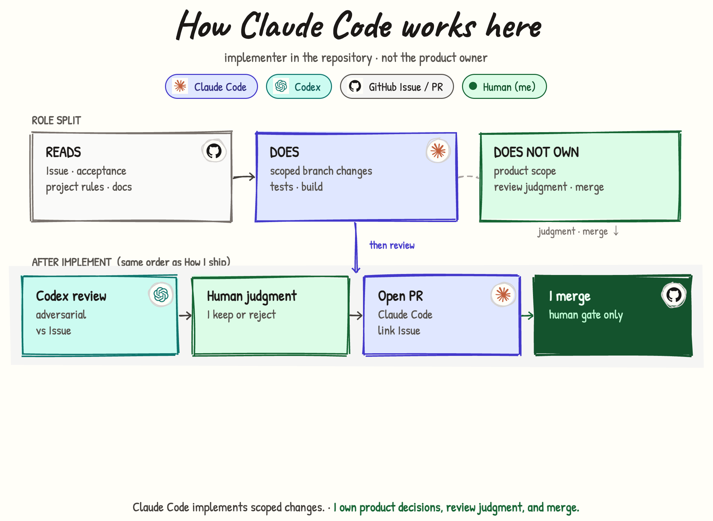

# How Claude Code works here（日本語）

## このページは何か

**自分のリポジトリで Claude Code に何を任せて、何を任せないか**を説明します。

一言でいうと:

- Claude Code は **実装者**であり、プロダクトオーナーではない  
- **Issue と docs を読み**、**ブランチでコードを変える**  
- **PR を開く**ことはある  
- プロダクトのスコープ最終決定・レビュー採否・**main へのマージはしない**（しない／させない）

[English](../how-claude.md)

あわせて読む:

- [How I ship](./how-i-ship.md) — 思いつきから本番までの全体  
- [知識が積み上がる仕組み](./how-knowledge.md) — claim と Issue の出どころ  

---

## 誰向けか

| 読む人 | 分かること |
|--------|------------|
| プロフィールを見た人 | 「AI が勝手に出荷」ではないこと |
| 一緒に作業する人 | PR を開く人 vs マージする人 |
| 将来の自分 | 崩したくない境界 |

---

## 役割の分割（図の上段）

| **読む（READS）** | **する（DOES）** | **持たない（DOES NOT OWN）** |
|-------------------|------------------|------------------------------|
| Issue · 受入条件 | スコープ内のブランチ変更 | プロダクトスコープ |
| プロジェクトルール · docs | tests · build | レビュー判断 |
| | | **main へのマージ** |

補足:

- 「tests · build」は Claude が回しがちな自動チェック  
- **hands-on** 検証を Claude 単独とは言わない。必要なときは自分が触る  

---

## 実装のあと（図の下段）

[How I ship](./how-i-ship.md) と同じ順序。ゲートを飛ばさない。

| 順 | 誰 | 何をする |
|----|-----|----------|
| 1. Codex レビュー | Codex | Issue に照らして厳しく見る |
| 2. 人間の判断 | 自分 | 指摘を残すか捨てるか |
| 3. PR を開く | **Claude Code** | PR を開き、Issue をリンクする |
| 4. 自分がマージ | **自分だけ** | main に入れる（または差し戻す） |

重要:

| 行為 | 担い手 |
|------|--------|
| PR を開く | Claude Code |
| マージする | 人間（自分） |

**PR を開くこと ≠ マージすること。**

---

## 他の2ページとの関係

| ページ | 焦点 |
|--------|------|
| [知識の流れ](./how-knowledge.md) | 観察 → claim → Issue |
| [How I ship](./how-i-ship.md) | ChatGPT やループ・本番を含む全体 |
| **このページ** | Claude の **境界だけ**（短くしてある） |

---

## これは何か／何ではないか

- 「Claude Code がマージしてくれる」ではない  
- 「Claude がロードマップを持つ」ではない  
- [How I ship](./how-i-ship.md) の完全な代替ではない  

---

## リンク

- [How I ship](./how-i-ship.md)  
- [知識が積み上がる仕組み](./how-knowledge.md)  
- プロフィール: [tatsunoritojo](https://github.com/tatsunoritojo)
