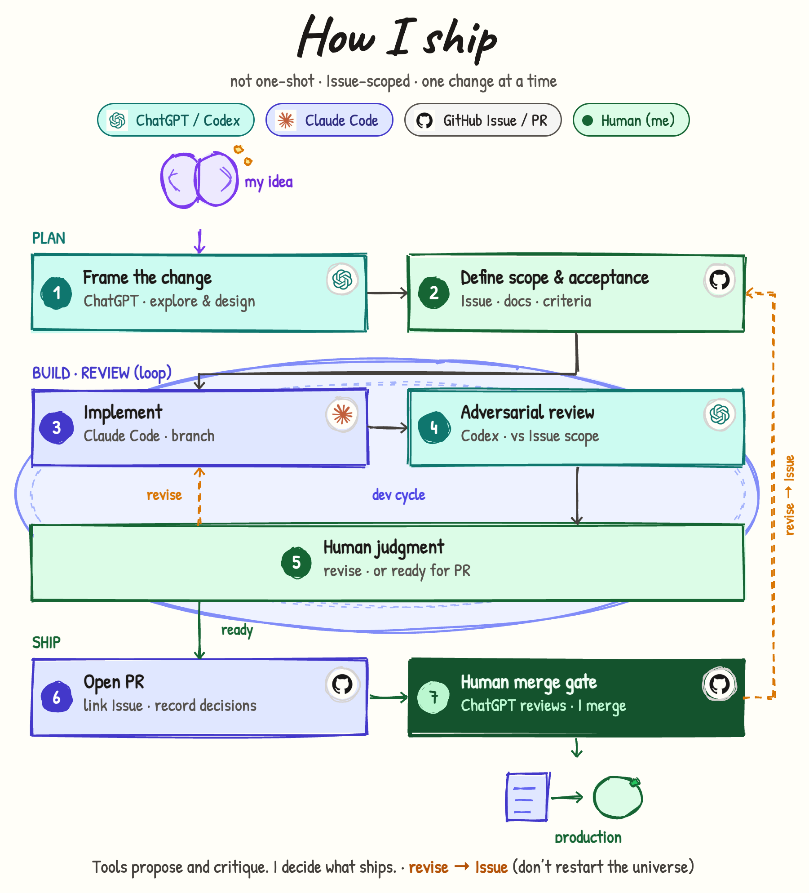

# How I ship（日本語）



## このページは何か

**ソフトウェアの変更を、思いつきから本番までどう進めるか**を説明します。AI ツールを使うときの自分のやり方です。

一言でいうと:

- AI に「いい感じに出荷して」とは頼まない  
- 作業は **GitHub Issue 1 本ずつ**に切る  
- AI は **提案とレビュー**をする  
- **マージするかどうかは自分が決める**

[English](../how-i-ship.md)

あわせて読む:

- [知識が積み上がる仕組み](./how-knowledge.md) — 考えが判断メモや Issue になるまで  
- [ここでの Claude Code](./how-claude.md) — Claude Code に任せる範囲と任せない範囲  

---

## 誰向けか

| 読む人 | 分かること |
|--------|------------|
| プロフィールを見た人 | AI をどう出荷に組み込んでいるか（魔法ではない） |
| 一緒に作業する人 | Issue・PR・マージの位置 |
| 将来の自分 | 崩したくないループ |

---

## 全体の流れ（先にこれだけ）

| 段階 | ステップ | 何のため |
|------|----------|----------|
| **Plan** | 1 → 2 | *何を*変えるかを決め、Issue にする |
| **Build · review（ループ）** | 3 → 4 → 5 | 実装し、厳しくレビューし、直すか PR にするか決める |
| **Ship** | 6 → 7 | PR を開き、**自分が**マージする（または差し戻す） |

```
思いつき → 計画（Issue）→ 実装・レビューのループ → PR → 自分がマージ → 本番
                ↑______________やり直し__________________|
```

---

## 誰が何をするか

| 役割 | 誰 / ツール | 仕事 |
|------|-------------|------|
| 考える | ChatGPT（実リポジトリに接続） | リポジトリの実情報を踏まえた壁打ち。空中戦の雑談ではない |
| スコープを切る | 自分 + **GitHub Issue** | 受入条件。作業の単位 |
| 実装する | **Claude Code** | ブランチで実装し、PR を開く |
| 厳しく見る | **Codex** | Issue に照らして差分を突く |
| 指摘を採否する | **自分** | レビュー指摘を残すか捨てるか |
| マージする | **自分** | main に入れるのは自分だけ |

図の色は、この役割分けに対応しています。

---

## 手順（図と同じ）

### Plan

1. **変更をフレーミングする** — ChatGPT  
   **実際のリポジトリに接続された ChatGPT** と壁打ちする。コードやプロジェクト構成を踏まえるので、確度の高い検討ができる。  
   この段階は選択肢と確認事項を出すところまでで、最終スコープの確定ではない。

2. **スコープと受入を定義する** — 自分、GitHub Issue  
   「完了」の意味を書く。以降はすべてこの Issue に縛られる。

### Build · review（ループ）

3. **実装する** — Claude Code  
   ブランチでスコープ内だけ。main へ直接 push しない。

4. **敵対レビュー** — Codex  
   雰囲気ではなく Issue の受入に対して見る。

5. **人間の判断** — 自分  
   - **revise** → 実装へ戻る（同じ Issue）  
   - **ready** → ループを抜けて PR を開く  

### Ship

6. **PR を開く** — Claude Code  
   Issue をリンクし、判断（却下した指摘と理由も含む）を残す。

7. **人間のマージゲート** — 自分  
   ChatGPT が PR の議論を手伝うことはある。**マージするのは自分**。だめなら Issue に戻す。  
   そのあと本番へ出せる。

---

## やり直しの道

| 種類 | いつ | 戻る先 |
|------|------|--------|
| **ループの revise** | 実装やレビューが足りない | ステップ 3（実装）、同じ Issue |
| **Issue の revise** | スコープや受入自体が違う | ステップ 2（Issue）。最初から全部やり直しにしない |

---

## これは何か／何ではないか

- 「AI がマージしてくれる」ではない  
- 曖昧な目標の巨大 PR ではない  
- チャット履歴を正本にしない（[知識の流れ](./how-knowledge.md)）

---

## リンク

- プロフィール上の図: [tatsunoritojo](https://github.com/tatsunoritojo)  
- [知識が積み上がる仕組み](./how-knowledge.md)  
- [ここでの Claude Code](./how-claude.md)
