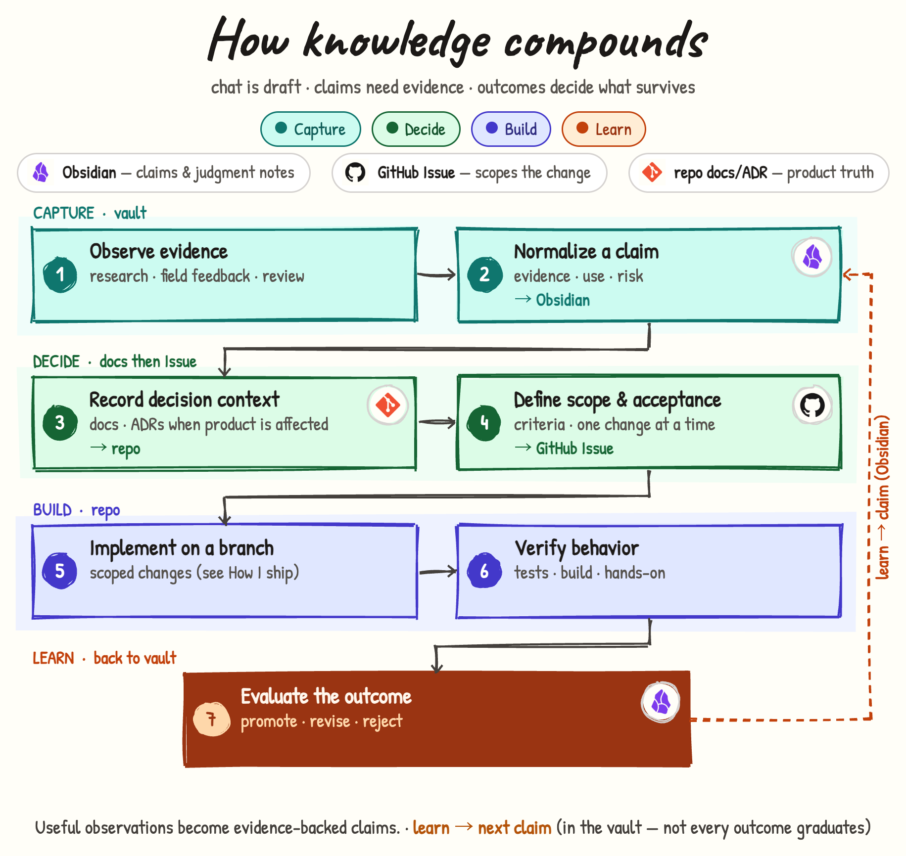

# How knowledge compounds（日本語）



## このページは何か

**ふわっとした観察を、あとで使える形にし、必要ならソフトウェア変更につなげる**流れを説明します。

一言でいうと:

- チャットは **下書き**であり、正本ではない  
- 証拠つきの **判断（あとで見返せる仮説）** を書く（多くは **Obsidian**）  
- プロダクトに残すべき決定は **リポジトリの docs / ADR** へ  
- コードを変える仕事は **GitHub Issue** に切る  
- 変更を入れたあと **結果を見て学ぶ**——多くの判断は弱まるか捨てる  

図の中の “claim” は、ここでは **証拠と用途を伴う、後から見直せる判断** の意味です。

[English](../how-knowledge.md)

あわせて読む:

- [How I ship](./how-i-ship.md) — 一つの変更を本番まで  
- [ここでの Claude Code](./how-claude.md) — 実装者とオーナーの境界  

---

## 誰向けか

| 読む人 | 分かること |
|--------|------------|
| プロフィールを見た人 | 「考える場所」「docs」「Issue」を分ける理由 |
| 一緒に作業する人 | 判断メモと変更チケットのどちらを見るか |
| 将来の自分 | 取り込む → 決める → 作る → 学ぶ |

---

## 置き場所（手順の前にこれ）

| 置き場 | 使うとき |
|--------|----------|
| **Obsidian** | 判断メモ、調査の取り込み、あとで見返す仮説 |
| **リポジトリの docs / ADR** | **プロダクトに効く**決定で、チャットより長く残したいとき |
| **GitHub Issue** | **変更**の単位（スコープと受入） |

「知識は全部 Obsidian」「すべてのリポジトリが何でも正本」とは言いません。

---

## 全体の流れ（先にこれだけ）

| 段階 | ステップ | 平たい意味 |
|------|----------|------------|
| **取り込む** | 1 → 2 | 気づく。あとで戻れる判断にする |
| **決める** | 3 → 4 | プロダクトに効くなら docs。コードを変えるなら Issue |
| **作る** | 5 → 6 | 実装して確かめる（詳細は [How I ship](./how-i-ship.md)） |
| **学ぶ** | 7 → 2 へ戻る | 判断は正しかったか。メモを更新するか捨てる |

```
観察 → 判断（Obsidian）→ 必要なら docs/ADR → Issue → 実装 → 結果を評価
         ↑______________ 学び（全部が残るわけではない） _______|
```

---

## 手順（図と同じ）

### 取り込む（Obsidian 中心）

1. **証拠を観察する**  
   調査、現場の声、レビュー、障害、ユーザー反応——失うと惜しいもの。

2. **判断を書き下ろす** → **Obsidian**  
   証拠・用途・リスクをつけて、あとで見返せる形にする。

### 決める（docs のあと Issue）

3. **決定の文脈を記録する** → **リポジトリ**（プロダクトに効くとき）  
   チャットより長く残り、作り方に効くなら docs / ADR。

4. **スコープと受入を定義する** → **GitHub Issue**  
   次に何を変え、何をもって完了とするか。  
   docs は *何が真か*、Issue は *何を変えるか*。

### 作る（リポジトリ）

5. **ブランチで実装する**  
   スコープ内だけ。道具とゲートの詳細は [How I ship](./how-i-ship.md)。

6. **振る舞いを検証する**  
   自動テスト・ビルド・必要なときの手元確認。「CI が緑だけ」ではない。

### 学ぶ（Obsidian へ戻る）

7. **結果を評価する**  
   信じたことを強める・直す・捨てる。  
   **学び → 次の判断（Obsidian）:** すべての結果が「正しかった」になるわけではない。

---

## 変更作業とのつながり

| 道 | 意味 |
|----|------|
| 知識 → Issue | 調査が、制御された変更になる |
| 判断なしで変える | 同じ学びを繰り返しやすい |
| 結果を見ない判断 | 体裁のいい意見 |

---

## これは何か／何ではないか

- 「全部メモに永久保存」ではない  
- 「チャット履歴が正本」ではない  
- [How I ship](./how-i-ship.md) の完全な代替ではない——変更の**周囲**の長い弧  

---

## リンク

- [How I ship](./how-i-ship.md)  
- [ここでの Claude Code](./how-claude.md)  
- プロフィール: [tatsunoritojo](https://github.com/tatsunoritojo)
